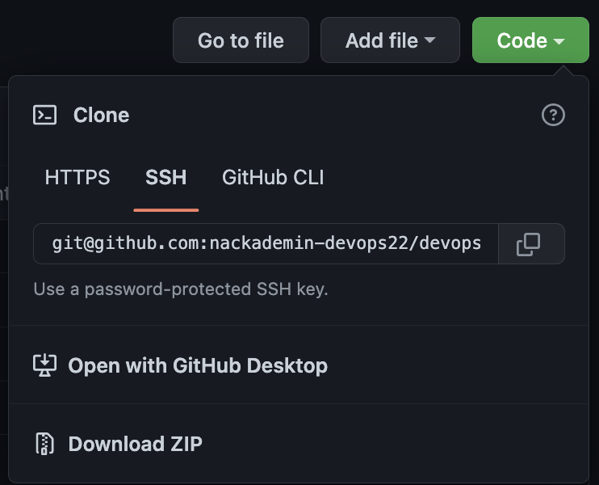

# devops22_python_final

## Betygskriterier

### För Godkänd (G) krävs att studenten får godkänt på följande kriterier

* Studenten kan utföra socketsprogrammering i Python
* Studenten kan skapa klientapplikationer som kommunicerar med en server via sockets
* Studenten kan skapa enhetstester och kan applicera testdriven utveckling
* Studenten förstår hur versionshantering fungerar i utvecklingsprocessen och kan
  använda något verktyg för versionshantering

### För Väl Godkänd (VG) krävs att studenten får godkänt på samtliga G – respektive VG-kriterier

* Studenten kan självständigt utveckla och optimera klientapplikationer
  som kommunicerar med en server via sockets
* Studenten visar god förmåga att applicera testdriven utveckling för att
  kvalitetssäkra applikationer eller kod som ska deployas

## Instruktioner

### Regler

* Slutuppgiften är enskild
* Det är ok att fråga lärare och varandra generella frågor.
* Ni ska skriva er egen kod, om ni använder er av kodbitar från webben
  t.ex. stackoverflow så måste ni ange källa. Ni kan också använda kursens exempel.
* Ni ansvarar för att betygskriterierna är uppfyllda, kolla er kursplan.

### Inlämning 9/11 23:59

* Glöm inte att merga era branches så att den slutgiltiga versionen finns `main` branchen
* Ladda också upp projektet i en zip på studentportalen, du kan få en zip av koden i github genom:
  
* Dubbelkolla att programmet fungerar, ni kan t.ex. clona repot i en ny folder och testa er branch där.
* Om ni har missat något finns en extra chans på seminariet att visa vad ni kan, var förberedd.
* Seminariet äger rum i små grupper Torsdag 10/11.

### Att välja uppgift

* Säg till mig på lektionen 3 nov vilken uppgift ni önskar.
* Det finns ingen garanti att alla kan få den uppgift de vill, så säg ett andra-, och tredjehandsval.

## Uppgifter

### Chat Tjänsten

I denna uppgift ska du skriva en chat-server med tillhörande klient.

#### Chat Tjänsten - Krav G

* Du kan fråga servern vilka klienter som är anslutna
* Du skickar meddelande från en klient (1) via servern till en annan klient (2).
* Du har något enhetstest

#### Chat Tjänsten - Krav VG

* Du kan skicka till en enskild person och alla
* Ditt protokoll klarar av att skicka text och bilder
* Koden är testbar och har rimliga enhetstester
* Klient och server arbetar på ett icke blockerade vis (trådar eller annan lösning)
* Klient och server arbetar på ett effektivt sätt och hanterar flera klienter

---

### Filserver

I denna uppgift ska du bygga en filserver. Filservern håller ett register över filer.

#### Filserver - Krav G

* Du kan fråga servern om vilka filer den har
* Du kan fråga servern hur stor en fil är
* Du kan be servern ta bort en fil
* Du skriver något enhetstest

#### Filserver - Krav VG

* Ditt protokoll klarar av text samt att hämta och ladda upp filer
* Du kan skicka en uppmaning till alla klienter att en ny fil finns
* Din kod är testbar och har rimliga enhetstester
* Klient och server arbetar på ett icke blockerade vis (trådar eller annan lösning)
* Klient och server arbetar på ett effektivt sätt och hanterar flera klienter

#### Filserver - Begränsningar

* Du behöver inte lagra filer på disk för G.
* För VG räcker det att överföra en fil.

---

### Kalendertjänsten

I denna uppgift ska du bygga en enkel Kalender.

#### Kalender - Krav G

* Du kan fråga servern om vilka möten du har
* Du kan fråga om detaljer för ett specifikt möte
* Du kan boka ett möte som sparas på servern
* Du skriver något enhetstest

#### Kalender - Krav VG

* Ditt protokoll klarar av text samt att hämta en fil med alla klienters bokade möten
* Du kan via klienten skicka upp en fil med flera bokningar.
* Du kan fråga servern om hur många möten som totalt som finns bokade för alla användare
* Din kod är testbar och har rimliga enhetstester
* Klient och server arbetar på ett icke blockerade vis (trådar eller annan lösning)
* Klient och server arbetar på ett effektivt sätt och hanterar flera klienter

#### Kalender - Begränsningar

* Du behöver inte hantera dubbelbokningar

---

### Bankkontot

I denna uppgift ska du bygga ett banksystem.

#### Bankkontot - Krav G

* Du kan lägga till en kund i registret
* Du kan fråga servern om vilka kunder som finns
* Du kan fråga om detaljer för en specifik kund
* Du skriver något enhetstest

#### Bankkontot - Krav VG

* Ditt protokoll klarar av text samt att hämta en fil med alla kunder
* Du kan via klienten skicka upp en fil med flera kunder som ska läggas till.
* En kund ska kunna låsas, då ska alla som försöker ändra kunden få ett meddelande om att ändringar inte är möjligt just nu.
* Din kod är testbar och har rimliga enhetstester
* Klient och server arbetar på ett icke blockerade vis (trådar eller annan lösning)
* Klient och server arbetar på ett effektivt sätt och hanterar flera klienter

#### Bankkontot - Begränsningar

* En kund = ett konto

---

### Det smarta hemmet

I denna uppgift ska du bygga en smart hem lösning. Dina mätvärden kan vara påhittade.

#### Det smarta hemmet - Krav G

* Du har en klient som skickar mätdata t.ex. temperatur eller luftfuktighet till din server
* Du har en annan användarklient som kan fråga servern om de senaste mätvärdena
* Du skriver något enhetstest

#### Det smarta hemmet - Krav VG

* Du kan fråga servern om en fil med historiska mätvärden
* Du kan via din användares klient fråga alla "mätdata" klienter om de är vid liv
* Du kan med klienten skicka en fil med flera historiska mätvärden som servern lägger till
* Din kod är testbar och har rimliga enhetstester
* Klient och server arbetar på ett icke blockerade vis (trådar eller annan lösning)
* Klient och server arbetar på ett effektivt sätt och hanterar flera klienter

---

### Serverhallen

I denna uppgift ska du bygga en övervakare till din serverhall. Dina mätvärden kan vara påhittade.

#### Serverhallen - Krav G

* Du har data klienter som skickar mätdata t.ex. temperatur eller cpu belastning till din server
* Du har en användarklient som kan fråga servern om de senaste mätvärdena
* Du skriver något enhetstest

#### Serverhallen - Krav VG

* Du kan fråga servern om en fil med historiska mätvärden
* Du kan via din användarklient skicka en uppmaning till alla klienter att skicka dig deras nuvarande mätvärden. Dvs. användarklient -> server -> data klienter -> server -> användarklient
* Du kan med klienten skicka en fil med flera mätvärden som servern lägger till historiken
* Din kod är testbar och har rimliga enhetstester
* Klient och server arbetar på ett icke blockerade vis (trådar eller annan lösning)
* Klient och server arbetar på ett effektivt sätt och hanterar flera klienter
  
---

### Egen uppgift

I denna uppgift ansvarar du själv för att skicka in ett förslag. Tänk på kursmålen och kom överens med läraren.

#### Egen uppgift - Krav G

* Du skickar text mellan två klienter, kommunikationen går via en server
* Du sparar någon slags information på servern
* Du skriver något enhetstest

#### Egen uppgift - Krav VG

* Ditt kommunikationsprotokoll har optimerats för olika sorters trafik
* Du kan styra hur servern skickar vidare data till andra klienter (t.ex. en eller alla)
* Din kod är testbar och har rimliga enhetstester
* Klient och server arbetar på ett icke blockerade vis (trådar eller annan lösning)
* Klient och server arbetar på ett effektivt sätt och hanterar flera klienter
